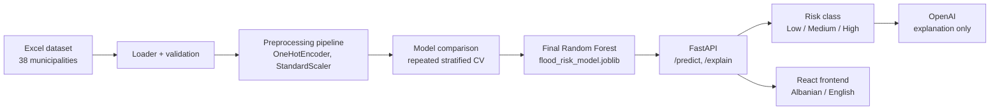

# Flood Risk AI — Kosovo

A machine-learning system that classifies the flood risk of Kosovo municipalities as **Low**, **Medium** or **High**, with a FastAPI backend, a bilingual (Albanian / English) web interface and natural-language explanations generated by OpenAI.

Bachelor's thesis project: *Implementation of an Intelligent Model for Flood Risk Assessment in Kosovo and Integration of OpenAI for Data Analysis and Interpretation.*


> **The ML model decides the risk class. OpenAI only explains it.**
> The class returned by the API always comes from the trained model. The explanation is generated afterwards, is checked against the model's class, and is discarded if it contradicts it.

---

## Contents

- [How it works](#how-it-works)
- [Results](#results)
- [Project structure](#project-structure)
- [Requirements](#requirements)
- [Quick start](#quick-start)
- [Configuration](#configuration)
- [Reproducing the ML pipeline](#reproducing-the-ml-pipeline)
- [API](#api)
- [Tests](#tests)
- [Data](#data)
- [Methodology](#methodology)
- [OpenAI integration](#openai-integration)
- [Limitations](#limitations)
- [Troubleshooting](#troubleshooting)

---

## How it works



**Training** runs offline from scripts in `backend/ml/` and produces a saved pipeline (preprocessing + model in one file). **Inference** happens in the API, which loads that file once at startup and never retrains.

The backend follows an **Onion Architecture**: the domain and application layers contain no ML or HTTP code; scikit-learn and OpenAI are reached only through interfaces implemented in the infrastructure layer.

```
presentation  ->  application  ->  domain  <-  infrastructure  ->  ml / OpenAI
(HTTP, Pydantic)  (use cases)     (entities,    (adapters)          (trained model,
                                   interfaces)                       language model)
```

---

## Results

All models were evaluated with the same 4-fold stratified cross-validation, repeated 10 times (40 fits per model). Scores are mean ± standard deviation over the 10 repeats.

| Model                              | Macro F1                 | Balanced accuracy | Recall Low     | Recall High    | Accuracy        |
| ---------------------------------- | ------------------------ | ----------------- | -------------- | -------------- | --------------- |
| Gradient Boosting                  | 0.650 ± 0.082           | 0.637             | 0.18           | 0.82           | 0.824           |
| **Random Forest (selected)** | **0.644 ± 0.033** | **0.644**   | **0.23** | **0.82** | **0.808** |
| Decision Tree                      | 0.620 ± 0.070           | 0.620             | 0.30           | 0.82           | 0.708           |
| Logistic Regression                | 0.547 ± 0.029           | 0.552             | 0.25           | 0.60           | 0.716           |
| SVM (RBF)                          | 0.479 ± 0.065           | 0.459             | 0.20           | 0.32           | 0.705           |
| KNN (k = 3)                        | 0.430 ± 0.046           | 0.424             | 0.03           | 0.33           | 0.729           |
| Baseline (always "Medium")         | 0.283                    | 0.333             | 0.00           | 0.00           | 0.737           |

- **Random Forest** was selected: it is tied with Gradient Boosting and Decision Tree within one standard deviation and is the most stable of the three.
- **Accuracy is misleading** for this dataset: the baseline reaches 73.7 % without recognising a single Low or High municipality. Macro F1 is therefore the primary metric.
- **High is recognised well, Low is not.** The Low class has only 4 examples.
- A **nested-CV tuning check** did not improve the Random Forest (−0.014 macro F1, within noise), so default settings were kept.
- An **ablation without `distance_from_river`** changed macro F1 only within noise.

Full results, confusion matrices and plots are in `backend/ml/experiments/`; the final model is documented in `backend/ml/models/model_card.json`.

---

## Project structure

```
flood-risk-ai/
├── data/raw/DataSeti_Finali.xlsx        # final dataset (38 municipalities)
├── backend/
│   ├── app/                             # FastAPI application (Onion Architecture)
│   │   ├── domain/                      # entities, RiskLevel, classifier/interpreter interfaces
│   │   ├── application/                 # FloodRiskService (use cases)
│   │   ├── infrastructure/              # ML adapter, OpenAI adapter, settings
│   │   ├── presentation/                # routes, request/response schemas
│   │   └── main.py                      # composition root, startup
│   ├── ml/
│   │   ├── config.py                    # schema, feature lists, units, paths
│   │   ├── data/loader.py               # Excel loading and validation
│   │   ├── analysis/eda.py              # exploratory analysis
│   │   ├── preprocessing/               # ColumnTransformer + Pipeline
│   │   ├── training/                    # CV, metrics, baseline, comparison, tuning, final training
│   │   ├── inference/predictor.py       # loads the saved model, makes predictions
│   │   ├── models/                      # flood_risk_model.joblib, model_card.json
│   │   └── experiments/                 # saved results (CSV/JSON) and plots
│   ├── tests/                           # pytest: domain, service, API, interpretation
│   ├── .env.example
│   └── pyproject.toml
└── frontend/
    ├── src/
    │   ├── features/flood-risk/         # API client, hooks, form, result, staff gauge
    │   ├── i18n/                        # Albanian and English texts
    │   ├── store/                       # selected language
    │   └── pages/, layouts/, components/
    ├── .env.example
    └── package.json
```

---

## Requirements

| Tool                            | Version                                |
| ------------------------------- | -------------------------------------- |
| Python                          | 3.12 or newer                          |
| [uv](https://docs.astral.sh/uv/) | Python package manager                 |
| Node.js                         | 20.19+ or 22.12+                       |
| OpenAI API key                  | Optional; only needed for explanations |

---

## Quick start

The trained model is included in the repository, so the application runs without retraining.

**1. Backend**

```bash
cd backend
uv sync
cp .env.example .env          # Windows PowerShell: Copy-Item .env.example .env
uv run fastapi dev app/main.py
```

The API runs at http://127.0.0.1:8000; interactive documentation is at http://127.0.0.1:8000/docs.

**2. Frontend** (in a second terminal)

```bash
cd frontend
npm install
npm run dev
```

Open http://localhost:5173. The interface opens in Albanian with Malishevë's data filled in as an example; English is available from the switch in the top right.

Without an OpenAI key, predictions work normally and the explanation section reports that explanations are not enabled.

---

## Configuration

### Backend — `backend/.env`

| Variable                   | Default                                               | Purpose                                                                       |
| -------------------------- | ----------------------------------------------------- | ----------------------------------------------------------------------------- |
| `OPENAI_API_KEY`         | *(empty)*                                           | Enables explanations. Never commit it.                                        |
| `OPENAI_MODEL`           | *(empty)*                                           | Any model available to your account via the Responses API, e.g.`gpt-6-luna` |
| `OPENAI_LANGUAGE`        | `English`                                           | Explanation language when a request does not specify one                      |
| `OPENAI_TIMEOUT_SECONDS` | `30`                                                | Timeout for the OpenAI request                                                |
| `CORS_ORIGINS`           | `["http://localhost:5173","http://127.0.0.1:5173"]` | Browser origins allowed to call the API (JSON list)                           |
| `FLOOD_MODEL_PATH`       | `backend/ml/models/flood_risk_model.joblib`         | Alternative model file                                                        |
| `FLOOD_MODEL_CARD_PATH`  | `backend/ml/models/model_card.json`                 | Alternative model card                                                        |
| `FLOOD_DATASET_PATH`     | `<repo>/data/raw/DataSeti_Finali.xlsx`              | Alternative dataset for the training scripts                                  |

### Frontend — `frontend/.env`

| Variable         | Default                   | Purpose                                                                      |
| ---------------- | ------------------------- | ---------------------------------------------------------------------------- |
| `VITE_API_URL` | `http://127.0.0.1:8000` | Backend address. Must point to the backend (port 8000), not to the frontend. |

Vite reads `.env` files only at startup; restart `npm run dev` after changing them.

---

## Reproducing the ML pipeline

All commands run from `backend/` and use the `ml` dependency group. The scripts are deterministic (fixed seeds), so the numbers above are reproduced exactly with scikit-learn 1.9.1.

| Step                        | Command                                                        | Output                                                                 |
| --------------------------- | -------------------------------------------------------------- | ---------------------------------------------------------------------- |
| Exploratory analysis        | `uv run --group ml python -m ml.analysis.eda`                | `experiments/results/eda/`, `experiments/plots/eda/`               |
| Baselines                   | `uv run --group ml python -m ml.training.baseline`           | `experiments/results/baseline/`                                      |
| Model comparison + ablation | `uv run --group ml python -m ml.training.compare_models`     | `experiments/results/comparison/`, `experiments/plots/comparison/` |
| Nested-CV tuning check      | `uv run --group ml python -m ml.training.tune_random_forest` | `experiments/results/tuning/` (takes a few minutes)                  |
| Final model                 | `uv run --group ml python -m ml.training.train`              | `models/flood_risk_model.joblib`, `models/model_card.json`         |

Every result folder contains a `run_info.json` with the dataset's SHA-256 hash, the scikit-learn version and the CV settings, so each result can be traced to the exact data it was produced from.

> The saved model must be loaded with the same scikit-learn version it was trained with. The version is pinned in `pyproject.toml` (`scikit-learn==1.9.1`).

---

## API

| Method   | Endpoint                                   | Description                                                 |
| -------- | ------------------------------------------ | ----------------------------------------------------------- |
| `POST` | `/api/flood-risk/predict`                | Risk class from the ML model                                |
| `POST` | `/api/flood-risk/explain?language=sq\|en` | Risk class plus OpenAI explanation                          |
| `GET`  | `/api/flood-risk/metadata`               | Soil types, units, training ranges, model info, limitations |
| `GET`  | `/health`                                | Health check                                                |

### Request

```json
{
  "municipality": "Malishevë",
  "elevation": 544,
  "distance_from_river": 0.21,
  "rainfall": 707.3,
  "soil_type": "Smonice",
  "max_water_level": 137,
  "min_water_level": 41,
  "min_slope": 2,
  "max_slope": 16
}
```

| Field                                    | Unit | Notes                                                            |
| ---------------------------------------- | ---- | ---------------------------------------------------------------- |
| `municipality`                         | —   | Optional. Used only in the explanation, never as a model feature |
| `elevation`                            | m    |                                                                  |
| `distance_from_river`                  | km   |                                                                  |
| `rainfall`                             | mm   |                                                                  |
| `soil_type`                            | —   | One of the values returned by`/metadata`                       |
| `max_water_level`, `min_water_level` | mm   | `min` must not exceed `max`                                  |
| `min_slope`, `max_slope`             | %    | `min` must not exceed `max`                                  |

Invalid input (missing fields, negative values, unknown soil type, unexpected fields, min > max) returns **422** with a description of the problem.

### Response of `/explain`

```json
{
  "municipality": "Malishevë",
  "risk": "Medium",
  "risk_code": 1,
  "class_scores": { "Low": 0.107, "Medium": 0.807, "High": 0.087 },
  "class_scores_note": "class_scores are the share of the model's trees voting for each class. They are model scores, not real-world probabilities of flooding.",
  "warnings": [],
  "out_of_range": [],
  "model": { "name": "random_forest", "cv_macro_f1_mean": 0.6444, "cv_macro_f1_std": 0.0331 },
  "interpretation": "Risk level: Medium\n\n...",
  "interpretation_status": "ok",
  "interpretation_note": "Generated by a language model from the prediction and input values only. It is not a scientifically verified causal explanation."
}
```

`/predict` returns the same fields without the three `interpretation*` fields.

- **`class_scores`** are the share of the Random Forest's trees voting for each class — model scores, not probabilities of flooding.
- **`warnings` / `out_of_range`** list input values outside the range of the training data, where the model is extrapolating.
- **`interpretation_status`**: `ok`, `disabled` (no key/model configured), `unavailable` (OpenAI error or timeout) or `rejected` (the explanation contradicted the model's class and was discarded). In every case the prediction itself is returned.

### Example call

```bash
curl -X POST "http://127.0.0.1:8000/api/flood-risk/predict" \
  -H "Content-Type: application/json" \
  -d '{"elevation":544,"distance_from_river":0.21,"rainfall":707.3,"soil_type":"Smonice","max_water_level":137,"min_water_level":41,"min_slope":2,"max_slope":16}'
```

PowerShell:

```powershell
$body = @{ elevation=544; distance_from_river=0.21; rainfall=707.3; soil_type="Smonice"
           max_water_level=137; min_water_level=41; min_slope=2; max_slope=16 } | ConvertTo-Json
Invoke-RestMethod -Method Post -Uri "http://127.0.0.1:8000/api/flood-risk/predict" -ContentType "application/json" -Body $body
```

---

## Tests

```bash
cd backend
uv run pytest -v
```

The suite (29 tests) covers the domain rules, the application service with a fake classifier, the HTTP endpoints with the real trained model, input validation, CORS, and the interpretation layer. The OpenAI client is replaced by a fake in all tests, so no API key is needed and no request is sent.

---

## Data

The dataset (`data/raw/DataSeti_Finali.xlsx`) contains **38 Kosovo municipalities** with 8 predictive features and the target `risk`.

| Feature                                  | Unit | Type                  |
| ---------------------------------------- | ---- | --------------------- |
| `elevation`                            | m    | numeric               |
| `distance_from_river`                  | km   | numeric               |
| `rainfall`                             | mm   | numeric               |
| `max_water_level`, `min_water_level` | mm   | numeric               |
| `min_slope`, `max_slope`             | %    | numeric               |
| `soil_type`                            | —   | categorical (7 types) |

Class distribution: **Low 4, Medium 28, High 6**.

**Sources**

- Hydrometeorological Institute of Kosovo — yearbook (*Vjetari HMK*): rainfall and water levels, from 2022 or 2024 depending on the municipality
- elevation.maplogs: elevation
- Kosova Gjeoportal: geographic data
- Global Map of Kosovo 2.0 (ISCGM / Kosovo Cadastral Agency): `distance_from_river`, computed as the straight-line distance from each municipal seat to the nearest river in the official 1:1,000,000 drainage layer (WGS84 / UTM 34N)

*Global Map of Kosovo ©ISCGM / Kosovo Cadastral Agency.*

**Labels.** The `risk` class was assigned by expert multi-criteria assessment of the same input features, not from recorded flood events. The labels were reviewed after the distance values were corrected.

---

## Methodology

- **Supervised multiclass classification** (Low / Medium / High) on structured data.
- **No separate hold-out set.** With 38 rows, a 20 % test set would hold about 1 Low and 1 High sample, so all evaluation uses cross-validation.
- **Repeated stratified k-fold** (4 folds × 10 repeats). The number of folds is derived from the smallest class (4 Low samples), so every test fold contains one Low sample.
- **Leakage prevention.** Scaling and one-hot encoding are part of the scikit-learn `Pipeline` and are refit on each training fold only.
- **Scores per repeat.** Within a repeat each municipality is predicted exactly once (out-of-fold), so metrics are computed on all 38 predictions and then averaged over repeats.
- **Class imbalance** is handled with `class_weight="balanced"` where available.
- **Baselines** (`DummyClassifier`) define the minimum a real model must exceed.
- **Minimal tuning.** One small, nested-CV grid for the selected model, to avoid fitting noise on 38 rows.
- **Final model** trained on all 38 rows; the CV results are the estimate of its performance. (Its accuracy on the training rows themselves is not a performance measure.)

---

## OpenAI integration

OpenAI is an interpretation layer after the prediction. It never determines or overrides the risk class.

- **What is sent:** only the current prediction — the predicted class, class scores, the 8 input values with units, any range warnings, the optional municipality name, and a short model summary (type, CV score, most-used features, limitations). No dataset rows and no other municipalities. Requests use `store=False`.
- **Prompt rules** (`app/infrastructure/openai_interpreter.py`): do not change or question the class, do not make an own assessment, do not call class scores probabilities, do not present feature importance as causes, do not invent data, mention limitations.
- **Enforced check:** the explanation must begin with `Risk level: <model's class>`. If it does not, it is discarded (`interpretation_status: "rejected"`).
- **Language:** the frontend requests explanations in the interface language (`sq` or `en`).
- **Fallback:** if OpenAI is not configured or fails, the prediction is still returned.

---

## Limitations

- The model is trained on **only 38 municipalities**; estimates have high variance and the model is not validated outside Kosovo.
- The labels are an **expert assessment based on the same features**, not observed floods. The model reproduces that assessment; it does not predict real flood events.
- The **Low class has 4 examples** and is recognised poorly; Low predictions are unreliable.
- Rainfall and water-level data come from **2022 or 2024** depending on the municipality.
- `distance_from_river` is derived from a **1:1,000,000** map; small rivers are not included and differences below about 0.5 km are not meaningful.
- **Class scores are not probabilities** of flooding, and **feature importances are not causes**.
- Generated explanations are **not scientifically verified** and may contain inaccuracies.

This is a research prototype and must not be used as the sole basis for safety decisions.

---

## Troubleshooting

| Problem                                                                        | Cause and fix                                                                                                                                                                      |
| ------------------------------------------------------------------------------ | ---------------------------------------------------------------------------------------------------------------------------------------------------------------------------------- |
| Frontend shows "…did not return JSON. Check VITE_API_URL."                    | `VITE_API_URL` points to the frontend instead of the backend. Set it to `http://127.0.0.1:8000` in every `frontend/.env*` file (or remove it), then restart `npm run dev`. |
| Frontend shows "Serveri nuk përgjigjet…" / "The server … is not responding" | The backend is not running. Start it with`uv run fastapi dev app/main.py` in `backend/`.                                                                                       |
| `interpretation_status: "disabled"`                                          | `OPENAI_API_KEY` or `OPENAI_MODEL` is missing in `backend/.env`. Restart the backend after editing.                                                                          |
| `interpretation_status: "unavailable"`                                       | OpenAI returned an error (invalid key, unknown model, quota, timeout). The cause is logged in the backend console.                                                                 |
| `Model not found` at startup                                                 | Train the model:`uv run --group ml python -m ml.training.train`.                                                                                                                 |
| `No module named ml...`                                                      | Run commands from the`backend/` directory.                                                                                                                                       |

---

Author: [@shpres1mKrasniqi](https://github.com/shpres1mKrasniqi)
